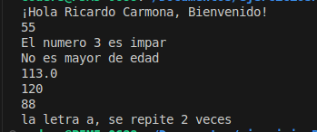
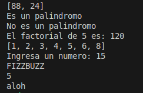
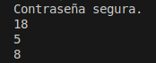

# Colección de Ejercicios de Python por Niveles

Este script contiene una serie de funciones en Python organizadas por nivel de dificultad: básico, intermedio y avanzado. Cada función está diseñada para practicar conceptos de programación con Python.

## 🟢 Nivel Básico

1. **Saludo personalizado:** Muestra un saludo personalizado con el nombre recibido.
2. **Suma de dos números:** Devuelve la suma de dos números.
3. **Número par o impar:** Determina si un número es par o impar.
4. **Mayoría de edad:** Devuelve si una edad representa a un adulto o menor de edad.
5. **Conversor de temperatura:** Convierte grados Celsius a Fahrenheit.
6. **Área de un triángulo:** Calcula el área dado base y altura.
7. **Mayor de una lista:** Encuentra el número mayor en una lista.
8. **Contar letras:** Cuenta cuántas veces aparece una letra específica en una palabra.

Resultados esperados:



## 🟡 Nivel Intermedio

9. **Filtrar pares:** Devuelve solo los números pares de una lista.
10. **Palíndromo:** Verifica si una palabra o frase es un palíndromo.
11. **Factorial:** Calcula el factorial de un número entero positivo.
12. **Eliminar duplicados:** Elimina elementos repetidos de una lista manteniendo el orden original.
13. **FizzBuzz:** Devuelve "Fizz", "Buzz" o "FizzBuzz" según reglas del juego.
14. **Contar vocales:** Cuenta la cantidad de vocales en una cadena.
15. **Invertir texto:** Devuelve el texto invertido.
 
Resultado esperado:



## 🔴 Nivel Avanzado

16. **Validar contraseña segura:** Verifica si una contraseña tiene mayúsculas, minúsculas, números y símbolos.
17. **Simular dado:** Simula el lanzamiento de un dado de 6 caras.
18. **Suma de elementos únicos:** Suma los números que no se repiten en una lista.
19. **Generador de contraseñas:** Genrnera una contraseña aleatoria.
20. **Composición de funciones:** Aplica una función dentro de otra usando un valor dado.

Resultado esperado:




---

## Requisitos
    Python 3.8+

## Cómo ejecutar las pruebas
    Descarga la carpeta ejerciciosPython
    Abre la terminal y navega a la carpeta donde se encuentran los archivos.
    Ejecuta el siguiente comando:

```bash
    python3 nivel1.py
```
### Asi sucesivamente con los otros niveles


